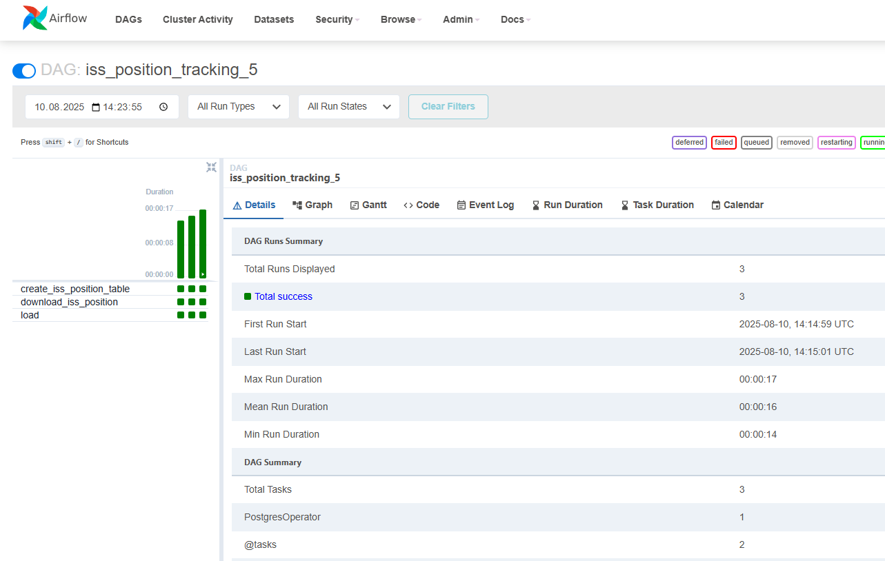
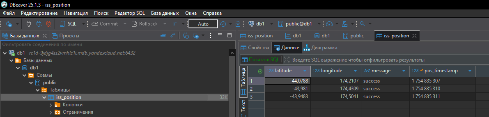

Отчёт по ДЗ к занятию «Оркестрация c Apache AirFlow».

1. Создан работающий облачный инстанс Apache Airflow.
    - Веб-интерфейс доступен по ссылке из приложенного файла
    - Логин: admin
    - Pwd: ---

2. Создан кластер СУБД PostgreSQL.
    - Хост: ---
    - Порт: 6432
    - Схема: db1
    - Логин: user1
    - Pwd: ---

3. Создан pipeline, содержащий в себе несколько task-ов и "крутящийся" по расписанию Airflow:
    Для выполнения ДЗ я реализовал загрузку данных о положении МКС в базу данных PostgreSQL.
    Исходный код piplen'а доступен в [файле](./iss_pos_5_dag.py).
    При создании pipeline я применил смешанный подход - использовал операторы и TaskFlow.

    Pipeline состоит из следующих задач:
    |Задача|id задачи|Реализаця|Описание|
    |---|---|---|---|
    |Подготовка структуры БД|create_iss_position_table|PostgresOperator|Создание таблицы в БД, если она ещё не создана|
    |Получение и преобразование данных|download_iss_position|task|Получает текущее положение МКС в виде json'а и кладёт эти данные в XCom, чтобы передать следующей задаче|
    |Сохранение данных в БД|load|task и вложенный PostgresOperator|Вытаскивает данные из XCom и сохраняет их в таблицу БД с помощью PostgresOperator|

4. Результаты работы DAG можно видеть на скриншотах:
    - Статистика DAG в веб-интерфейсе Airflow
        
    - Данные в БД
        