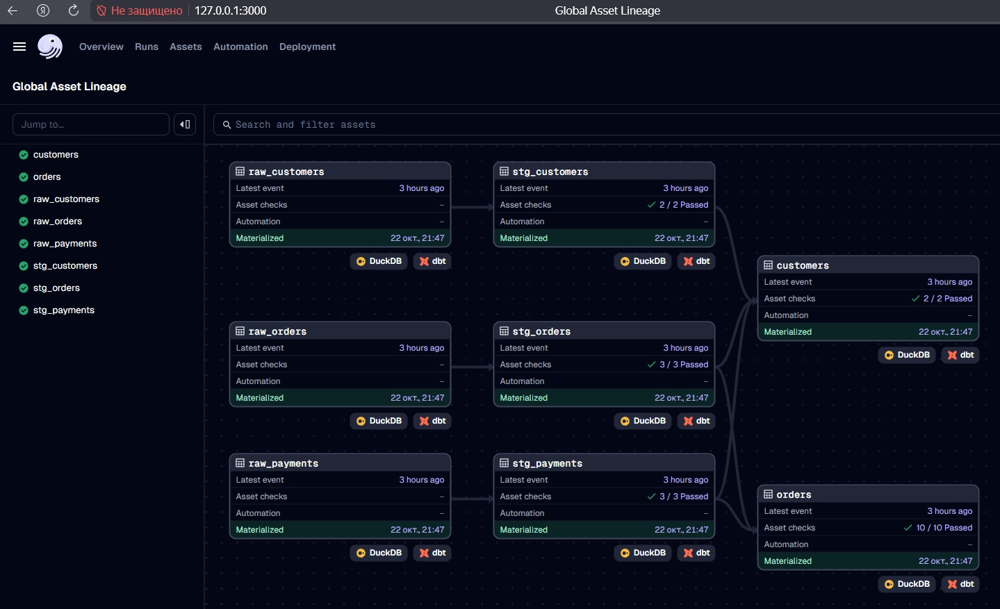

Отчёт по ДЗ к занятию «Оркестрация Dagster и DBT».

**Задача:** Выполнить настройку ETL.

Результат:
По [инструкции](https://docs.dagster.io/integrations/libraries/dbt) выполнена настройка ETL с помощью Dagster и DBT.
Скриншот с результатом материализации ассетов - .

Возникшие проблемы:
Туториал по ссылдке предлагает также выполнить инкрементную загрузку данных.
Я не смог её реализовать. Все попытки приводили в ошибкам при выполнении питоновских скриптов.
Поизучал исходники, но не смог до конца понять в чём причина ошибки.
Так же выполнил несколько более простых туториалов, но это не помогло понять, что я сделал неверно.

**Задача:** Сравнить Dagster и Apache Airflow.

Результат:

На мой взгляд Dagster обладает лишь одним неоспоримым преимуществом перед AF - современным пользовательским интерфейсом.
Эти два продукта занимают несколько разную нишу.
AirFlow более дружелюбен к пользователю, проще в освоении и требует меньшей квалификации при выполнении более-менее стандартных задач.
Dagster более гибок благодяря концепции SDA, позволяет решать нестандартные (практически любые) задачи, но требует от пользователя гораздо большей квалификации, в том числе в Python.
С другой стороны, если решается нестандартная задача, то и в AirFlow можно напрограммировать практически всё что угодно.
Правда, в этом случае разработчкиу приётся хорошо разобраться с внутренним устройством AirFlow.
Но доступно большое количество материалов практичеcки по любому сложному вопросу.
По Dagster материалов меньше.
К сожалению, не имею возможности сравнить производительность этих оркестраторов. Но думаю, она будет примерно одинакова.

При выполнении реального проекта выбор между AirFlow и Dagster будет обусловлен тремя факторами:
- наличием специалиста(ов) по его настройке в команде;
- требованиями заказчика и зрелостью его IT-инфраструктуры (взаимосвязанные вещи);
- квалификацией персонала IT-службы заказчика.

В проектах с моим участием, всегда принималось решение в пользу максимально простой реализации пожеланий заказчика.
Естественно, заказчику приходилось идти на компромисс либо по производительности решения, либо по затратам на железо, либо по обучению своих специалистов.
Если используемые инструменты максимально просты и стандартны, то заказчик сможет легко найти исполнителя для поддержки или развития решения.
С другой стороны, если решение сложное, то потеря какого-нибудь ключевого специалиста из команды разработки может погубить проект целиком.
Поэтому я выступаю за более простые инструменты - за Airbyte :=)