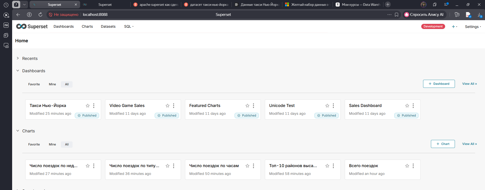
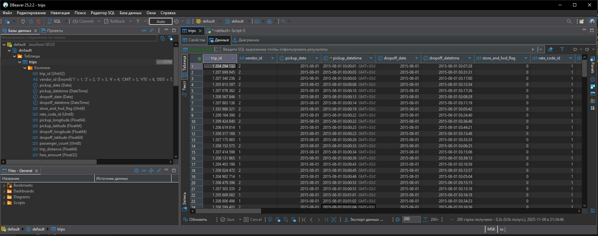
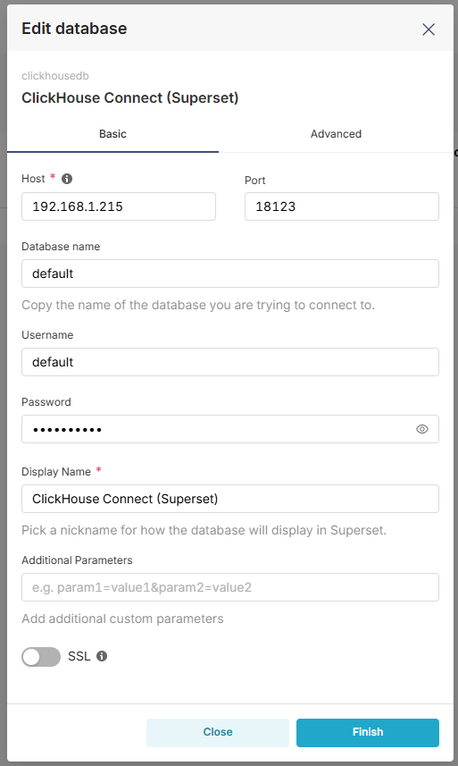
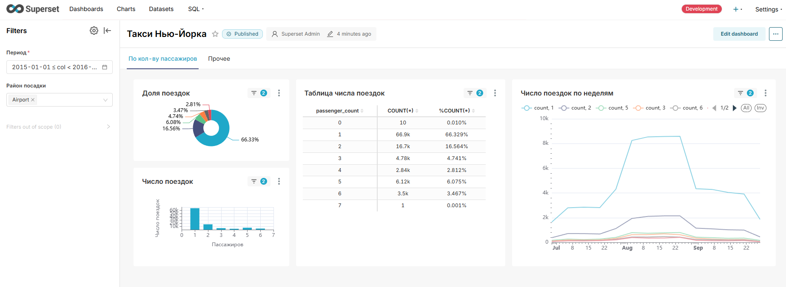
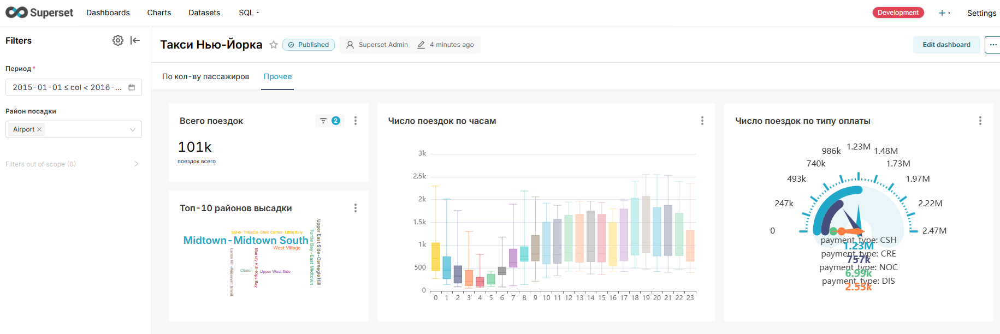

## Отчёт по ДЗ к занятию «Подготовка инфраструктуры для предоставления BI отчетности»

### **Задача:** 

1. Развернуть BI решение
2. Подключить источник данных
3. Построить дашборд

### *Результат:*

1. Развернул ClickHouse и Apache Superset.

По мануалу [Using Docker Compose](https://superset.apache.org/docs/installation/docker-compose) развернул Superset в локальном инстансе Docker. 
Для подключения ClickHouse добавил в репозитарии файл docker\requirements-local.txt, и в него вписал пакет clickhouse-connect.
Скриншот GUI Superset: 

По мануалу [Install ClickHouse using Docker](https://clickhouse.com/docs/install/docker) также развернул ClickHouse, и по мануалу [Данные такси Нью-Йорка](https://clickhouse.com/docs/ru/getting-started/example-datasets/nyc-taxi) залил в него датасет жёлтого такси Нью-Йорка. 
Скриншот датасета в CH: 

### *Возникшие проблемы:*

Superset зависал после завершения инициализации инстанса. 
Контейнер superset-app не стартовал. Я смотрел логи контейнеров, и пришёл к выводу, что возникла какая-то пробема с Node.js.
Развернул всю инфраструктуру с нуля и проблема самоустранилась. 

2. Подключил ClickHouse к Superset.

В GUI Superset добавил новое соединение к СУБД: 

3. Построить дашборд

Создал новый дашборд с двумя вкладками и общим на весь дашборд фильтром.

Вкладка 1: 
Использованные типы диаграмм:

- Pie Chart
- Bar Chart
- Table
- Line Chart

 
Вкладка 2: 
Использованные типы диаграмм:

- Big Number
- Word Cloud
- Box Plot
- Gauge Chart

Всего восемь диаграмм, из них 4 - нестандартные.
